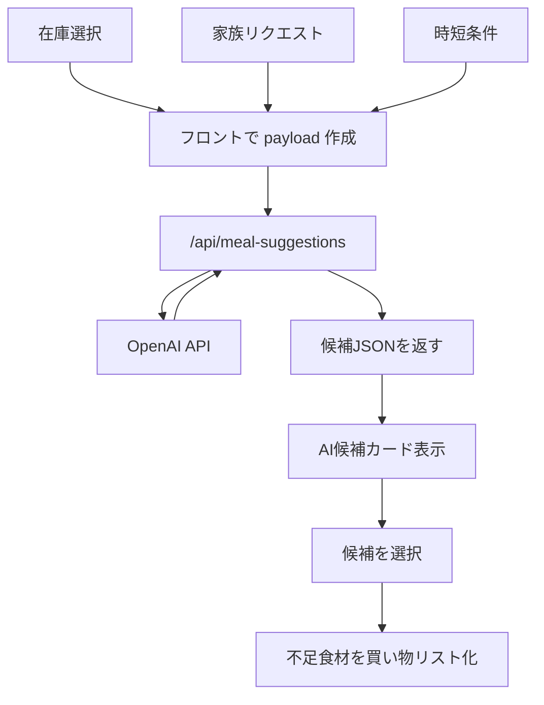

# AI献立候補 設計メモ

## 目的

家にある食材、家族の献立リクエスト、時短条件をもとに、AI が今夜の献立候補を生成する。

今の固定 `recipes` 配列だけではレパートリーが少なくなりやすいので、まずは `AIで候補を出す` 方向に広げる。

## 基本方針

- AI は `候補生成` と `不足食材の推定` を担当する
- アプリは `在庫管理`、`家族リクエスト管理`、`買い物リスト管理` を担当する
- 既存の固定レシピは消さず、`保険のローカル候補` として残す
- AIが失敗しても、既存候補は出せるようにする

## 先に決めること

### MVP でやること

1. 選択中の在庫を AI に送る
2. 家族の献立リクエストを AI に送る
3. `20分以内` 条件を AI に送る
4. AI が 3〜5件の候補を返す
5. 候補ごとに以下を返す
   - 献立名
   - 一言説明
   - 想定時間
   - 必要食材
   - 家にある食材
   - 足りない食材
   - 子ども向け/節約/時短などのタグ

### MVP でやらないこと

- レシピ本文の自動生成
- 外部レシピサイト本文の保存
- 家族全員ごとの好み学習
- 厳密な栄養計算

## UIの変更イメージ

### 現在

- `recipes` 配列から在庫一致率順に出す

### 変更後

- `通常候補`
  既存の固定レシピ
- `AIおすすめ`
  その日の在庫と家族希望を元に動的生成

### 画面の追加要素

- `AIで献立を考える` ボタン
- `考え中...` ローディング表示
- `今日はこれが合いそうです` の見出し
- 失敗時は `固定候補を表示しています` の案内

## システム構成

### フロント

今の静的アプリをそのまま使う。

- `index.html`
  AI候補表示エリア、実行ボタンを追加
- `script.js`
  AI API 呼び出し、ローディング、レスポンス整形を追加

### バックエンド

静的公開だけでは API キーを安全に置けないので、AI 呼び出しは別のサーバー経由にする。

最小構成は次のどちらか。

1. `Netlify Functions`
2. `Vercel Functions`

どちらでもよいが、今の静的サイト公開と相性が良い。

## API設計

### エンドポイント

`POST /api/meal-suggestions`

### リクエスト例

```json
{
  "selectedPantry": ["玉ねぎ", "卵", "ごはん", "しょうゆ"],
  "inventory": [
    { "name": "豆腐", "category": "たんぱく質", "level": "ある" }
  ],
  "recipeRequests": [
    { "dish": "カレー", "owner": "こども", "done": false }
  ],
  "quickOnly": true,
  "maxSuggestions": 4
}
```

### レスポンス例

```json
{
  "suggestions": [
    {
      "id": "ai-1",
      "name": "豆腐たまご丼",
      "description": "卵と豆腐でやさしい味にまとめた時短どんぶり。",
      "time": 15,
      "tags": ["時短", "節約", "子ども向け"],
      "ingredients": ["豆腐", "卵", "玉ねぎ", "ごはん", "しょうゆ"],
      "availableIngredients": ["卵", "玉ねぎ", "ごはん", "しょうゆ"],
      "missingIngredients": ["豆腐"],
      "reason": "今ある食材が多く、子ども向けで短時間だから"
    }
  ]
}
```

## AIへの指示設計

### 役割

AIには次を強く指示する。

- 日本の家庭料理に寄せる
- 冷蔵庫在庫から現実的に作れるものを優先
- 難しすぎる料理は避ける
- 足りない食材は少なめにする
- 家族リクエストがあれば優先する
- JSONだけ返す

### プロンプトの骨子

```text
あなたは家庭向け献立アシスタントです。
家にある食材と家族の希望から、現実的な夕食候補を3〜5件提案してください。

制約:
- 日本の一般家庭で作りやすい料理
- 食材の不足は最小限
- quickOnly=true の場合は 20分以内
- 子どもがいる家庭でも出しやすい候補を優先
- 必ず JSON で返す
```

### 出力形式

JSON schema を固定して、フロントでそのまま描画できる形にする。

## モデル方針

最初は `OpenAI Responses API` で十分。

### 要件

- JSONを安定して返せる
- コストが重すぎない
- 短い推論で候補を出せる

### 推奨

- 初期: 軽量モデルで候補生成
- 将来: 必要なら高精度モデルへ切り替え

## フロント実装方針

### state に追加するもの

```js
aiSuggestions: [],
aiStatus: "idle", // idle | loading | success | error
aiError: null,
lastAiInputHash: null
```

### 新しく作る関数

- `requestAiSuggestions()`
- `renderAiSuggestions()`
- `buildAiPayload()`
- `normalizeAiSuggestions()`
- `fallbackToLocalRecipes()`

### 動作

1. 在庫や条件を選ぶ
2. `AIで献立を考える` を押す
3. ローディング表示
4. APIレスポンスを描画
5. 候補選択で既存の買い物リスト生成へつなぐ

## データの流れ



## エラー時の設計

- AI API が落ちたら固定候補を出す
- JSON不正なら1回だけ再試行
- タイムアウトしたら `固定候補を表示` と出す
- 候補が0件なら `条件をゆるめて再提案` を出す

## セキュリティ

- API キーはフロントに置かない
- Functions の環境変数に置く
- 家族限定コードとは別管理
- レート制限を軽く入れる

## 実装ステップ

### Step 1

固定レシピを残したまま、AI候補用の UI を追加する

### Step 2

`/api/meal-suggestions` の Function を作る

### Step 3

フロントから API を呼んで AI候補を表示する

### Step 4

AI候補から買い物リストに接続する

### Step 5

家族リクエストの重み付けを調整する

## 今のアプリに対するおすすめ実装順

1. `AIで献立を考える` ボタンを追加
2. AI候補セクションを追加
3. 固定候補と AI候補を併存
4. Netlify Functions か Vercel Functions に API を置く
5. 公開 URL でスマホ確認

## 結論

このアプリに AI献立候補を入れるのは十分現実的。

いちばん安全で作りやすいのは、

- フロントは今の静的アプリを活かす
- AI呼び出しはサーバー関数に分離する
- 固定レシピは fallback として残す

という構成。
